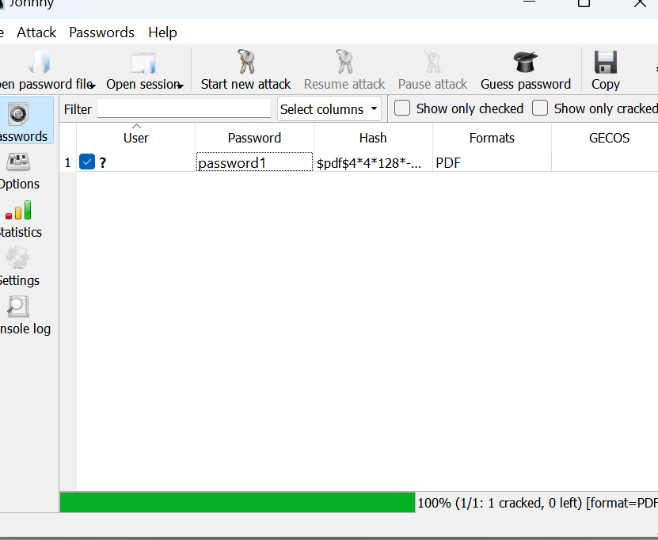
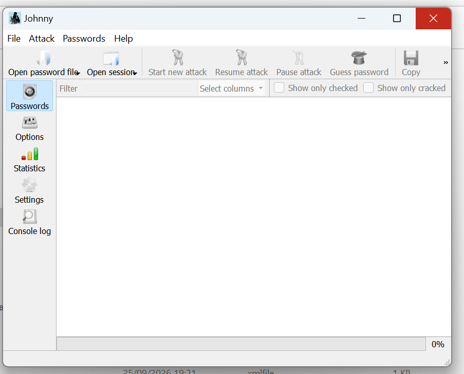
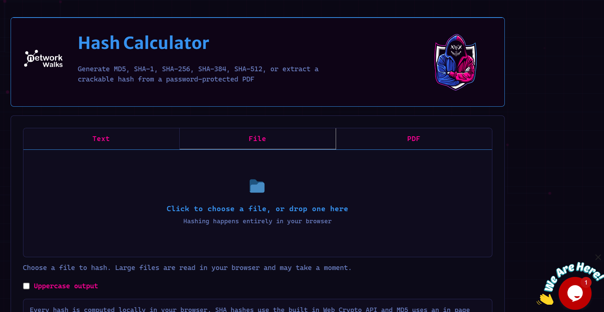
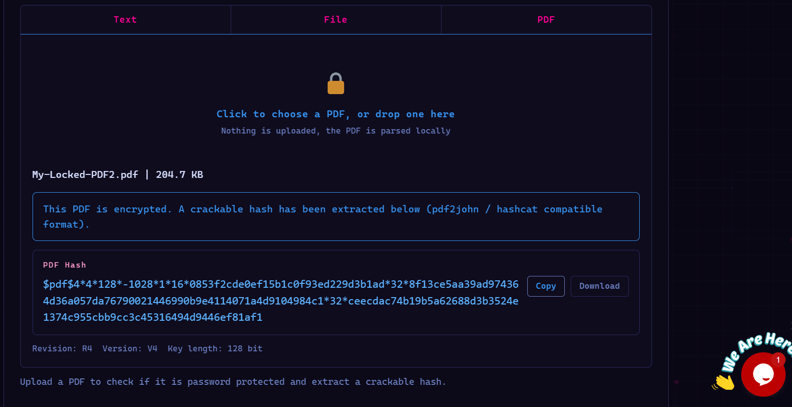
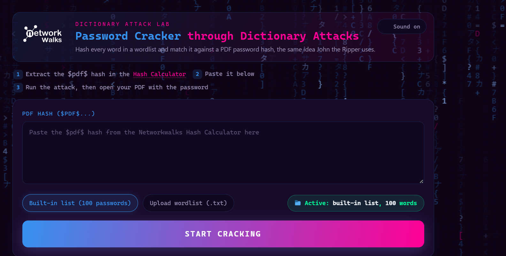
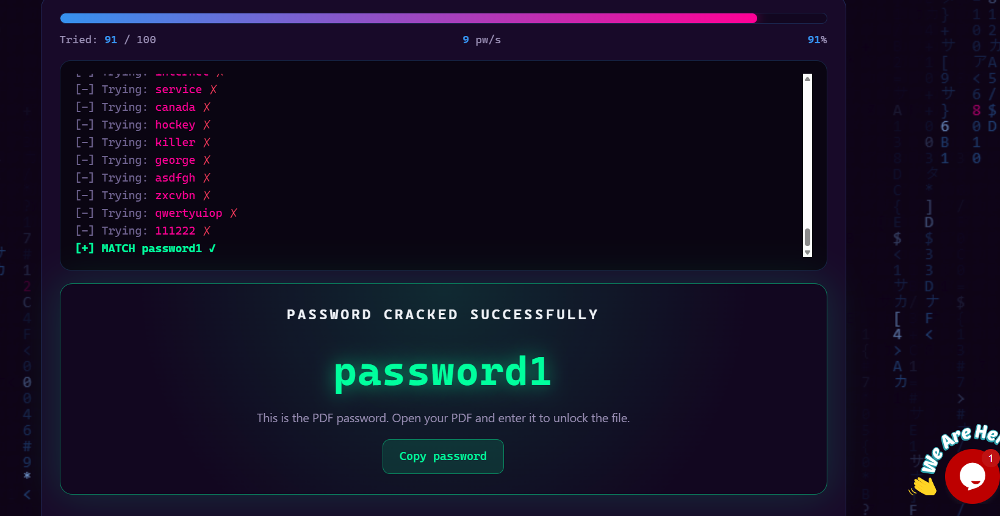
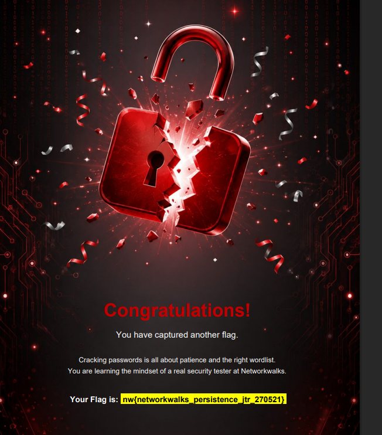

# networkwalks-B083-week3-Password-cracking
# Week 3: Password Cracking & Cryptographic Analysis Lab

A hands-on cybersecurity project demonstrating hash extraction, dictionary-based attack methodologies, and credential recovery using **John the Ripper (JTR)**, **Johnny GUI**, and **Networkwalks Web-Based Security Tools**.

---

## 📌 Project Overview
Password cracking is an essential methodology used by security professionals and penetration testers to evaluate password policy resilience and demonstrate the risks associated with weak credentials.

This project covers two core practical modules:
1. **Module 1:** Offline hash extraction and cracking using **John the Ripper** and its graphical front-end **Johnny**
2. **Module 2:** Web-based cryptographic hash extraction and dictionary recovery using **Networkwalks Hash Calculator** and **Password Cracker**

---

## 🛠️ Tools & Technologies
- **Target File:** Password-protected encrypted document (`My Locked PDF1.pdf`)
- **Hash Extraction:** `pdf2john` / Online Hash Crack extractor, Networkwalks Hash Calculator
- **Cracking Engines:**
  - [John the Ripper (JTR)](https://www.openwall.com/john/) v1.9.0-jumbo (CLI)
  - [Johnny](https://openwall.info/wiki/john/johnny) v2.2 (GUI)
  - Networkwalks In-Browser Dictionary Cracker
- **Target Environment:** Windows 10 / Kali Linux

---

## 🔬 Key Concepts Demonstrated

### 1. Encryption vs. Hashing
- **Encryption:** A two-way function where ciphertext can be converted back to plaintext using the appropriate decryption key.
- **Hashing:** A one-way mathematical function that converts plaintext into a fixed-length unique message digest (e.g., MD5, SHA-256). It cannot be reversed directly; recovery relies on matching candidate hashes.

---

## 🚀 Execution & Walkthrough

### Module 1: Cracking with John the Ripper (JTR) & Johnny GUI

1. **Extract Hash:**
   - Uploaded `My Locked PDF1.pdf` to the hash extraction utility to generate the `$pdf$`-formatted hash string.
   - Verified the hash format began with `$pdf$...` and saved it to `hash1.txt`.
2. **Configure Johnny GUI:**
   - Linked Johnny to the local `john.exe` binary path (`.../run/john.exe`).
3. **Execute Attack:**
   - Loaded `hash1.txt` into Johnny via **Open password file**.
   - Triggered **Start new attack**.
   - **Result:** Successfully recovered the plaintext password: `password1`.
4. **Flag Capture:**
   - Entered the recovered password into `My Locked PDF1.pdf` and verified document integrity to capture Flag 1.

---

### Module 2: Cracking with Browser-Based Networkwalks Tools

1. **Hash Generation & Extraction:**
   - Loaded the locked PDF into the **Networkwalks Hash Calculator** (`/hash-calculator/`).
   - Extracted the complete `$pdf$` message digest.
2. **Online Dictionary Attack:**
   - Loaded the extracted hash into the **Networkwalks Password Cracker**.
   - Executed a dictionary search against the built-in wordlist.
3. **Result:**
   - Recovered plaintext match: `password1`.
   - Unlocked the encrypted PDF and validated the completion banner.

---

## 🔒 Security Takeaways & Defenses
- **Length & Complexity Matter:** Simple 8-character, lowercase passwords can be identified within seconds via modern dictionary/rule attacks, whereas 12+ character mixed passphrases scale the computational difficulty exponentially.
- **Default & Predictable Passwords:** Credentials like `password1` or `123456` appear in common wordlists (such as `rockyou.txt`), rendering standard hash protections ineffective against offline attacks.
- **Mitigation:** Enforce multi-factor authentication (MFA), utilize robust key derivation functions with high iteration counts (e.g., Argon2, bcrypt, PBKDF2), and mandate strong, complex passphrase standards.

---

## ⚠️ Disclaimer
*All activities in this repository were performed in a controlled educational lab environment for defensive and ethical learning purposes only.*

Here are some screenshots showing how i used JTR and Browser-Based Networkwalks Tools to crack the passwords to the locked PDFS that i have uploaded
## 🏗️ Lab Architecture

